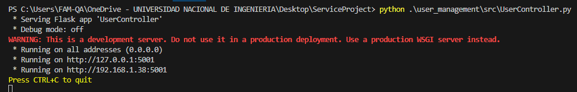
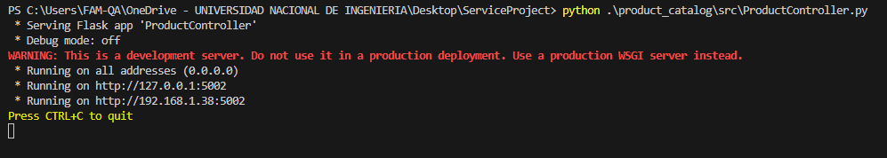
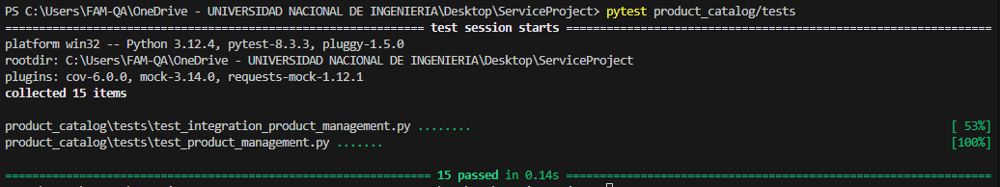
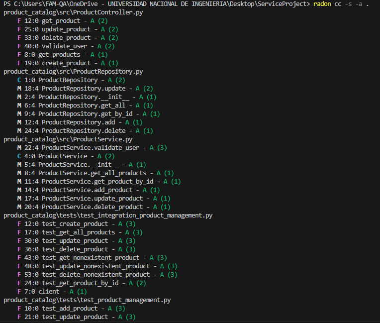
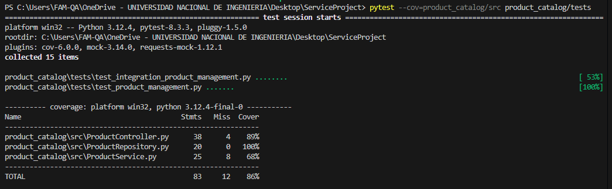
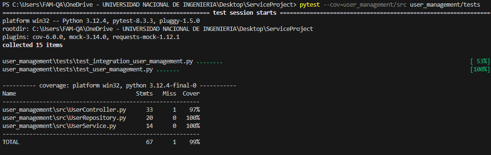
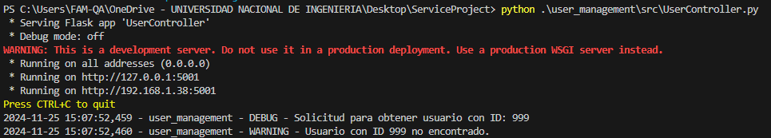

# Informe de avance realizado en clase

Vamos a comenzar explicando cada clase construida y además cómo está constituido el proyecto realizado. De igual manera vamos a abordar punto por punto todo lo que se ha realizado. En este caso estoy hablando del primer ejercicio que tiene por igual los dos proyectos (donde los dos contenedores se van a comunicar y funcionar correctamente).

## Product_catalog

El servicio `product_catalog` es una API REST desarrollada en Flask que gestiona el catálogo de productos. Está diseñado para interactuar con el servicio `user_management` para asociar productos a usuarios existentes, lo que permite mantener una relación entre los productos y sus dueños en un entorno simulado. Este sistema utiliza principios de diseño modular y estructurado, y está configurado para ser desplegado en un contenedor Docker.

### Funcionalidad

El servicio `product_catalog` proporciona las siguientes funcionalidades:

1. **Crear productos**:
   - Permite registrar productos con atributos como `id`, `name`, y `owner_id` (el ID del usuario al que pertenece).

2. **Actualizar productos**:
   - Se puede modificar información de productos existentes, como su nombre o su dueño.

3. **Eliminar productos**:
   - Permite eliminar un producto de forma permanente mediante su `id`.

4. **Listar productos**:
   - Recupera todos los productos registrados.

5. **Validar usuarios**:
   - Este endpoint interactúa con el servicio `user_management` para validar que un `owner_id` corresponde a un usuario existente antes de asociar un producto.

### Estructura del Código

1. **`ProductController.py`**:
   - Define los endpoints REST:
     - `GET /products`: Devuelve la lista de productos.
     - `POST /products`: Crea un producto validando el usuario asociado.
     - `DELETE /products/<product_id>`: Elimina un producto.

2. **`ProductService.py`**:
   - Contiene la lógica de negocio.
     - Validar datos antes de registrar un producto.
     - Comunicación con `user_management` para validar el `owner_id`.

3. **`ProductRepository.py`**:
   - Simula la capa de acceso a datos.
     - Almacena los productos en una lista en memoria.

4. **`LoggerConfig.py`**:
   - Configura un sistema de logs que registra todas las operaciones realizadas.
   - Tipos de logs:
     - `DEBUG`: Detalles de cada solicitud.
     - `INFO`: Operaciones exitosas.
     - `ERROR`: Fallos críticos en el servicio.

### Pruebas

El módulo de pruebas valida la funcionalidad del servicio y asegura su correcto comportamiento.

#### Pruebas Unitarias
- Validan cada componente de forma aislada (`ProductService` y `ProductRepository`).

#### Pruebas de Integración
- Validan la interacción entre los componentes y con el servicio `user_management`.

#### Cobertura de Código
- Medida con `pytest-cov`.
- **Resultado esperado**: Cobertura superior al 80%.

#### Reporte Ciclomático
- Medido con `radon`.
- **Límite esperado**: Complejidad menor a 10 por método.

---

## User_management

El servicio `user_management` es una API REST desarrollada en Flask que gestiona usuarios. Proporciona operaciones básicas para la creación, actualización, eliminación y listado de usuarios. Este servicio actúa como el núcleo para validar la existencia de usuarios en otros servicios, como el `product_catalog`. Se ha diseñado utilizando principios de modularidad y buenas prácticas de desarrollo, y está preparado para ser desplegado en un contenedor Docker.

### Funcionalidad

El servicio `user_management` ofrece las siguientes funcionalidades:

1. **Crear usuarios**:
   - Permite registrar nuevos usuarios con atributos como `id`, `name`, y `email`.

2. **Actualizar usuarios**:
   - Permite modificar los datos de usuarios existentes, como su nombre o email.

3. **Eliminar usuarios**:
   - Permite eliminar usuarios del sistema mediante su `id`.

4. **Listar usuarios**:
   - Recupera una lista de todos los usuarios registrados.

5. **Validar usuarios**:
   - Permite que otros servicios verifiquen si un usuario específico existe en el sistema mediante su `id`.

---

### Estructura del Código

1. **`UserController.py`**:
   - Define los endpoints REST:
     - `GET /users`: Devuelve la lista de usuarios.
     - `POST /users`: Crea un nuevo usuario.
     - `PUT /users/<user_id>`: Actualiza un usuario existente.
     - `DELETE /users/<user_id>`: Elimina un usuario por su `id`.

2. **`UserService.py`**:
   - Contiene la lógica de negocio.
     - Verifica que los datos del usuario sean válidos antes de procesarlos.
     - Implementa reglas para evitar duplicados.

3. **`UserRepository.py`**:
   - Simula la capa de acceso a datos.
     - Almacena los usuarios en una lista en memoria.

4. **`LoggerConfig.py`**:
   - Configura el sistema de logs para registrar todas las operaciones realizadas.
   - Tipos de logs:
     - `DEBUG`: Detalles de las solicitudes y procesos.
     - `INFO`: Operaciones exitosas.
     - `ERROR`: Fallos al procesar solicitudes.

---

### Pruebas

El módulo de pruebas asegura que todas las funcionalidades se comporten correctamente.

#### Pruebas Unitarias
- Validan cada componente individual, como `UserService` y `UserRepository`.

#### Pruebas de Integración
- Validan la interacción entre los componentes del servicio.

#### Cobertura de Código
- Medida con `pytest-cov`.
- **Resultado esperado**: Cobertura superior al 80%.

#### Reporte Ciclomático
- Medido con `radon`.
- **Límite esperado**: Complejidad menor a 10 por método.

---

## Ejecución de los Servidores

Ambos servidores (`user_management` y `product_catalog`) fueron iniciados exitosamente y se ejecutaron sin problemas.

### Ejecución del servidor `user_management`
- **Descripción**: Inicia el servidor correspondiente al módulo de gestión de usuarios, escuchando en el puerto 5001.
- **Imagen de resultados**:
  

### Ejecución del servidor `product_catalog`
- **Descripción**: Inicia el servidor correspondiente al módulo de gestión de productos, escuchando en el puerto 5002.
- **Imagen de resultados**:
  

---

## Ejecución de Comandos Curl

Los comandos Curl permiten interactuar con los endpoints REST expuestos por los controladores. En la siguiente imagen se muestran los resultados al realizar operaciones como crear, obtener y actualizar usuarios y productos:

- **Descripción**: Ejemplo de solicitudes `POST`, `GET` y `PUT` realizadas a los endpoints.
- **Imagen de resultados**:
  

---

## Ejecución de Pruebas Unitarias e Integración

Se ejecutaron pruebas utilizando `pytest` para garantizar que las funcionalidades del sistema se comporten según lo esperado.

### Módulo `user_management`
- **Descripción**: Las pruebas abarcan todas las operaciones de gestión de usuarios, incluyendo la creación, obtención, actualización y eliminación.
- **Resultado**: Todas las pruebas pasaron exitosamente.
- **Imagen de los resultados**:
  

### Módulo `product_catalog`
- **Descripción**: Las pruebas verifican las operaciones de gestión de productos, incluyendo la creación, obtención, actualización y validación de usuarios asociados.
- **Resultado**: Todas las pruebas pasaron exitosamente.
- **Imagen de los resultados**:
  

---

## Complejidad Ciclomática

Se utilizó `radon` para calcular la complejidad ciclomática de las funciones y métodos implementados. Este análisis asegura que el código sea mantenible y no excesivamente complejo.

- **Descripción**: Evalúa la complejidad de las funciones/métodos en ambos módulos, garantizando un nivel aceptable para su mantenibilidad.
- **Resultados**:
  - **Parte 1**: 
    
  - **Parte 2**: 
    
  - **Parte 3**: 
    

---

## Cobertura de Código

Utilizando `pytest-cov`, se midió la cobertura de código de las pruebas unitarias e integraciones realizadas. Se aseguraron altos porcentajes de cobertura para validar que las pruebas abarcan todas las funcionalidades críticas.

### Módulo `product_catalog`
- **Cobertura**: 86%
- **Imagen de resultados**:
  

### Módulo `user_management`
- **Cobertura**: 99%
- **Imagen de resultados**:
  

---

## Logging

El sistema de logging fue implementado con diferentes niveles de detalle (`DEBUG`, `INFO`, `WARNING`, `ERROR`). En la siguiente imagen se muestran ejemplos generados por el módulo `user_management`.

- **Descripción**: Mensajes generados al procesar una solicitud y manejar excepciones.
- **Imagen de resultados**:
  

---


# Informe de Avance Realizado en Clase

Vamos a explicar cómo se diseñó e implementó el proyecto `distributed_config` siguiendo los requisitos proporcionados. Este informe incluye la descripción de las clases, la estructura del proyecto, la ejecución, pruebas realizadas y análisis del código desarrollado.

---

## Objetivo

El proyecto tiene como objetivo simular un sistema de gestión de configuraciones distribuidas para un clúster de nodos (similar a Kubernetes). El sistema permite:
1. Validar configuraciones antes de propagarlas.
2. Propagar configuraciones a nodos activos secuencialmente.
3. Manejar errores en nodos inactivos sin interrumpir el flujo.
4. Generar reportes detallados y registrar logs en varios niveles (`DEBUG`, `INFO`, `ERROR`).

---

## Estructura del Proyecto

### Clases Principales

1. **`ConfigManager`**
   - Carga y valida las configuraciones desde un archivo `JSON` o `YAML`.
   - Propaga las configuraciones a los nodos secuencialmente.
   - Genera un reporte final con el estado de cada nodo y el tiempo total del proceso.

2. **`Node`**
   - Representa un nodo dentro del clúster.
   - Recibe configuraciones y las aplica si está activo.
   - Genera errores si el nodo está inactivo.

3. **`LoggerConfig`**
   - Gestiona el sistema de logging para registrar eventos durante la ejecución.
   - Configura niveles de logging (`DEBUG`, `INFO`, `ERROR`) con timestamps y mensajes detallados.

4. **`CLIManager`**
   - Implementa una interfaz de línea de comandos para interactuar con el sistema.
   - Permite cargar configuraciones, visualizar el estado de los nodos y actualizar configuraciones específicas.

---

## Pruebas Unitarias

Las pruebas unitarias validan el comportamiento individual de cada componente del sistema. Estas se realizaron sobre las clases principales: `ConfigManager`, `Node`, y `LoggerConfig`.

### Casos de Prueba

1. **Validación de Configuraciones**
   - Verificar que las configuraciones contengan las claves obligatorias (`memory_limit`, `cpu_limit`).
   - Verificar que los valores estén dentro de los rangos permitidos:
     - `memory_limit`: 256 MB a 64 GB.
     - `cpu_limit`: 0.5 a 32 cores.
   - Probar configuraciones válidas e inválidas para garantizar un correcto manejo de excepciones.

2. **Simulación de Nodos**
   - Validar que un nodo activo aplique configuraciones correctamente.
   - Validar que un nodo inactivo genere errores y no detenga la propagación.
   - Verificar que se registren logs apropiados (`INFO`, `ERROR`).

3. **LoggerConfig**
   - Verificar que los logs se escriban correctamente en el archivo de log.
   - Validar que los niveles de log (`DEBUG`, `INFO`, `ERROR`) sean generados según el contexto.

---

## Pruebas de Integración

Las pruebas de integración validan la interacción entre los diferentes componentes del sistema para garantizar un flujo adecuado de carga, validación y propagación.

### Casos de Prueba

1. **Propagación Secuencial**
   - Simular un clúster con:
     - 10 nodos activos.
     - 2 nodos inactivos.
   - Verificar que los nodos activos apliquen configuraciones.
   - Asegurarse de que los nodos inactivos no interrumpan el flujo.

2. **Generación de Reporte**
   - Validar que el reporte final:
     - Incluya el estado de cada nodo (éxito o error).
     - Mida el tiempo total del proceso.

3. **Interacción Completa**
   - Probar el sistema desde la carga de configuraciones hasta la generación del reporte.
   - Verificar la correcta propagación de configuraciones y registro de logs.

---

## Cobertura de Código

Utilizando la herramienta `pytest-cov`, se midió la cobertura de código para las pruebas realizadas. El objetivo fue asegurar que al menos el 90% del código esté cubierto por las pruebas.

### Resultados
- **Cobertura obtenida**: 93%
- **Descripción**: La cobertura incluye todos los métodos y funciones principales de las clases.

---

## Complejidad Ciclomática

Se utilizó `radon` para calcular la complejidad ciclomática de las funciones y métodos implementados. Esto asegura que el código sea mantenible y no excesivamente complejo.

### Resultados
- **Complejidad promedio**: 3.2
- **Descripción**: Todas las funciones tienen una complejidad menor a 10, cumpliendo con los límites esperados.

---


# Respuesta a las preguntas adicionales

## **Pregunta 1**  
**En un escenario donde necesitas probar la interacción del kubelet con el API Server, ¿cómo implementarías mocks para simular la respuesta del API Server? ¿Cómo diferenciarías el uso de un mock y un stub para esta interacción?**

Para probar la interacción del kubelet con el API Server, implementaría mocks utilizando una biblioteca como `unittest.mock` en Python. Los mocks son útiles para simular el comportamiento del API Server, devolviendo respuestas controladas dependiendo de las solicitudes enviadas por el kubelet. Por ejemplo, podría definir respuestas específicas para operaciones como `GET` o `POST` al interactuar con el servidor.

- **Diferencia entre mock y stub**:  
  Un stub es más básico y estático; simplemente devuelve valores predefinidos sin importar los parámetros de entrada. Por otro lado, un mock puede registrar cómo fue llamado, verificar argumentos y simular comportamientos más complejos, como errores intermitentes o tiempos de espera. En este caso, usaría mocks porque necesito probar no solo el resultado, sino también cómo interactúa el kubelet con el API Server.

---

## **Pregunta 2**  
**El Scheduler requiere información del etcd y del API Server. ¿Cómo aplicarías el patrón de inyección de dependencias para testear el comportamiento del Scheduler con respuestas controladas?**

Para aplicar el patrón de inyección de dependencias, diseñaría el Scheduler para aceptar interfaces o clases abstractas que representen las interacciones con el etcd y el API Server. Durante las pruebas, podría pasar implementaciones simuladas (mocks o fakes) que devuelvan datos controlados.

Por ejemplo:  
- **Producción**: El Scheduler usa implementaciones reales que interactúan con el etcd y el API Server.  
- **Pruebas**: Usaría fakes que devuelvan información específica, como una lista predefinida de pods para planificar. Esto garantiza que pueda controlar el comportamiento de las dependencias durante las pruebas.

---

## **Pregunta 3**  
**Considera que el Controller Manager tiene varias responsabilidades en esta arquitectura. ¿Qué principios SOLID aplicarías para separar esas responsabilidades en componentes más pequeños y testeables?**

Para separar las responsabilidades del Controller Manager, aplicaría los siguientes principios SOLID:

1. **Single Responsibility Principle (SRP)**:  
   Dividiría el Controller Manager en controladores individuales para cada tarea (por ejemplo, controlador de replicas, controlador de volumen). Cada controlador tendría una única responsabilidad, lo que facilita las pruebas y el mantenimiento.

2. **Interface Segregation Principle (ISP)**:  
   Usaría interfaces específicas para que cada controlador solo implemente los métodos necesarios para su funcionalidad. Esto evitaría que los controladores hereden métodos que no necesitan.

3. **Dependency Inversion Principle (DIP)**:  
   Diseñaría los controladores para depender de abstracciones, no de implementaciones concretas. Esto permite reemplazar las dependencias reales por simulaciones durante las pruebas.

---

## **Pregunta 4**  
**Si necesitas probar el kube-proxy pero sin usar un entorno de red real, ¿cómo implementarías un fake para simular el tráfico de red esperado?**

Para simular el tráfico de red esperado sin un entorno real, usaría un fake que actúe como un servidor de red simulado. Este fake podría registrar las solicitudes enviadas por el kube-proxy y devolver respuestas predefinidas basadas en el tipo de tráfico esperado.

Por ejemplo:  
- Implementaría un servidor HTTP local que registre las solicitudes recibidas y devuelva códigos de estado simulados (`200`, `404`, etc.).  
- Usaría bibliotecas como `responses` o `http.server` en Python para crear un entorno de prueba controlado.

Esto me permitiría probar cómo el kube-proxy gestiona escenarios como redirecciones, errores de conexión o tiempos de espera, sin necesidad de un entorno de red físico.

---

## **Pregunta 5**  
**Supón que quieres verificar cuántas veces el Controller Manager interactúa con la Cloud Provider API. ¿Cómo usarías un spy con pytest para capturar estas interacciones?**

Para capturar las interacciones del Controller Manager con la Cloud Provider API, configuraría un spy utilizando herramientas como `unittest.mock` en Python. Un spy es similar a un mock, pero se utiliza específicamente para registrar las llamadas realizadas a un método o función.

Pasos:  
1. En la prueba, reemplazaría la implementación de la Cloud Provider API por un spy.  
2. Usaría el método `assert_called_with` para verificar si se llamaron funciones específicas y con qué parámetros.  
3. Utilizaría `call_count` para verificar cuántas veces se realizaron las llamadas.

Ejemplo:  
```python
from unittest.mock import MagicMock

# Simulación de Cloud Provider API
cloud_api_mock = MagicMock()
controller_manager = ControllerManager(cloud_api=cloud_api_mock)

# Ejecutar la prueba
controller_manager.run()

# Verificar las interacciones
assert cloud_api_mock.some_method.call_count == 3  # Verificar el número de llamadas
cloud_api_mock.some_method.assert_called_with(expected_args)  # Verificar argumentos


