# Informe de avance realizado en clase

Vamos a comenzar explicando cada clase construida y además cómo está constituido el proyecto realizado. De igual manera vamos a abordar punto por punto todo lo que se ha realizado. En este caso estoy hablando del primer ejercicio que tiene por igual los dos proyectos (donde los dos contenedores se van a comunicar y funcionar correctamente).

## Product_catalog

El servicio `product_catalog` es una API REST desarrollada en Flask que gestiona el catálogo de productos. Está diseñado para interactuar con el servicio `user_management` para asociar productos a usuarios existentes, lo que permite mantener una relación entre los productos y sus dueños en un entorno simulado. Este sistema utiliza principios de diseño modular y estructurado, y está configurado para ser desplegado en un contenedor Docker.

### Funcionalidad

El servicio `product_catalog` proporciona las siguientes funcionalidades:

1. **Crear productos**:
   - Permite registrar productos con atributos como `id`, `name`, y `owner_id` (el ID del usuario al que pertenece).

2. **Actualizar productos**:
   - Se puede modificar información de productos existentes, como su nombre o su dueño.

3. **Eliminar productos**:
   - Permite eliminar un producto de forma permanente mediante su `id`.

4. **Listar productos**:
   - Recupera todos los productos registrados.

5. **Validar usuarios**:
   - Este endpoint interactúa con el servicio `user_management` para validar que un `owner_id` corresponde a un usuario existente antes de asociar un producto.

### Estructura del Código

1. **`ProductController.py`**:
   - Define los endpoints REST:
     - `GET /products`: Devuelve la lista de productos.
     - `POST /products`: Crea un producto validando el usuario asociado.
     - `DELETE /products/<product_id>`: Elimina un producto.

2. **`ProductService.py`**:
   - Contiene la lógica de negocio.
     - Validar datos antes de registrar un producto.
     - Comunicación con `user_management` para validar el `owner_id`.

3. **`ProductRepository.py`**:
   - Simula la capa de acceso a datos.
     - Almacena los productos en una lista en memoria.

4. **`LoggerConfig.py`**:
   - Configura un sistema de logs que registra todas las operaciones realizadas.
   - Tipos de logs:
     - `DEBUG`: Detalles de cada solicitud.
     - `INFO`: Operaciones exitosas.
     - `ERROR`: Fallos críticos en el servicio.

### Pruebas

El módulo de pruebas valida la funcionalidad del servicio y asegura su correcto comportamiento.

#### Pruebas Unitarias
- Validan cada componente de forma aislada (`ProductService` y `ProductRepository`).

#### Pruebas de Integración
- Validan la interacción entre los componentes y con el servicio `user_management`.

#### Cobertura de Código
- Medida con `pytest-cov`.
- **Resultado esperado**: Cobertura superior al 80%.

#### Reporte Ciclomático
- Medido con `radon`.
- **Límite esperado**: Complejidad menor a 10 por método.

---

## User_management

El servicio `user_management` es una API REST desarrollada en Flask que gestiona usuarios. Proporciona operaciones básicas para la creación, actualización, eliminación y listado de usuarios. Este servicio actúa como el núcleo para validar la existencia de usuarios en otros servicios, como el `product_catalog`. Se ha diseñado utilizando principios de modularidad y buenas prácticas de desarrollo, y está preparado para ser desplegado en un contenedor Docker.

### Funcionalidad

El servicio `user_management` ofrece las siguientes funcionalidades:

1. **Crear usuarios**:
   - Permite registrar nuevos usuarios con atributos como `id`, `name`, y `email`.

2. **Actualizar usuarios**:
   - Permite modificar los datos de usuarios existentes, como su nombre o email.

3. **Eliminar usuarios**:
   - Permite eliminar usuarios del sistema mediante su `id`.

4. **Listar usuarios**:
   - Recupera una lista de todos los usuarios registrados.

5. **Validar usuarios**:
   - Permite que otros servicios verifiquen si un usuario específico existe en el sistema mediante su `id`.

---

### Estructura del Código

1. **`UserController.py`**:
   - Define los endpoints REST:
     - `GET /users`: Devuelve la lista de usuarios.
     - `POST /users`: Crea un nuevo usuario.
     - `PUT /users/<user_id>`: Actualiza un usuario existente.
     - `DELETE /users/<user_id>`: Elimina un usuario por su `id`.

2. **`UserService.py`**:
   - Contiene la lógica de negocio.
     - Verifica que los datos del usuario sean válidos antes de procesarlos.
     - Implementa reglas para evitar duplicados.

3. **`UserRepository.py`**:
   - Simula la capa de acceso a datos.
     - Almacena los usuarios en una lista en memoria.

4. **`LoggerConfig.py`**:
   - Configura el sistema de logs para registrar todas las operaciones realizadas.
   - Tipos de logs:
     - `DEBUG`: Detalles de las solicitudes y procesos.
     - `INFO`: Operaciones exitosas.
     - `ERROR`: Fallos al procesar solicitudes.

---

### Pruebas

El módulo de pruebas asegura que todas las funcionalidades se comporten correctamente.

#### Pruebas Unitarias
- Validan cada componente individual, como `UserService` y `UserRepository`.

#### Pruebas de Integración
- Validan la interacción entre los componentes del servicio.

#### Cobertura de Código
- Medida con `pytest-cov`.
- **Resultado esperado**: Cobertura superior al 80%.

#### Reporte Ciclomático
- Medido con `radon`.
- **Límite esperado**: Complejidad menor a 10 por método.

---

## Ejecución de los Servidores

Ambos servidores (`user_management` y `product_catalog`) fueron iniciados exitosamente y se ejecutaron sin problemas.

### Ejecución del servidor `user_management`
- **Descripción**: Inicia el servidor correspondiente al módulo de gestión de usuarios, escuchando en el puerto 5001.
- **Imagen de resultados**:
  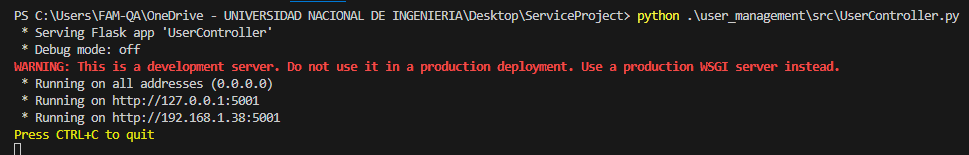

### Ejecución del servidor `product_catalog`
- **Descripción**: Inicia el servidor correspondiente al módulo de gestión de productos, escuchando en el puerto 5002.
- **Imagen de resultados**:
  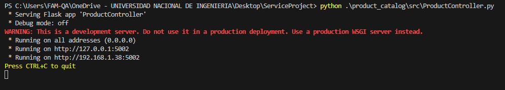

---

## Ejecución de Comandos Curl

Los comandos Curl permiten interactuar con los endpoints REST expuestos por los controladores. En la siguiente imagen se muestran los resultados al realizar operaciones como crear, obtener y actualizar usuarios y productos:

- **Descripción**: Ejemplo de solicitudes `POST`, `GET` y `PUT` realizadas a los endpoints.
- **Imagen de resultados**:
  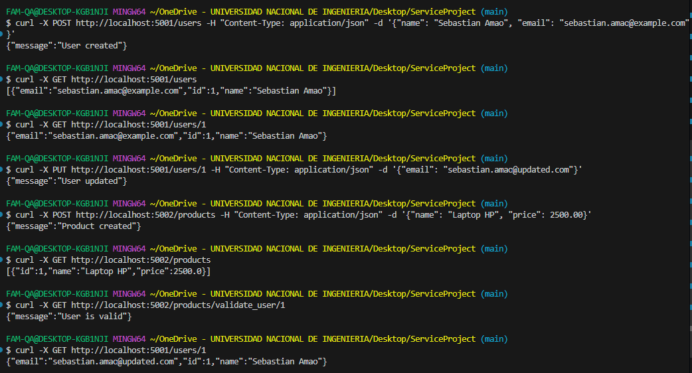

---

## Ejecución de Pruebas Unitarias e Integración

Se ejecutaron pruebas utilizando `pytest` para garantizar que las funcionalidades del sistema se comporten según lo esperado.

### Módulo `user_management`
- **Descripción**: Las pruebas abarcan todas las operaciones de gestión de usuarios, incluyendo la creación, obtención, actualización y eliminación.
- **Resultado**: Todas las pruebas pasaron exitosamente.
- **Imagen de los resultados**:
  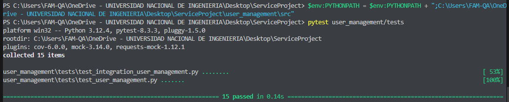

### Módulo `product_catalog`
- **Descripción**: Las pruebas verifican las operaciones de gestión de productos, incluyendo la creación, obtención, actualización y validación de usuarios asociados.
- **Resultado**: Todas las pruebas pasaron exitosamente.
- **Imagen de los resultados**:
  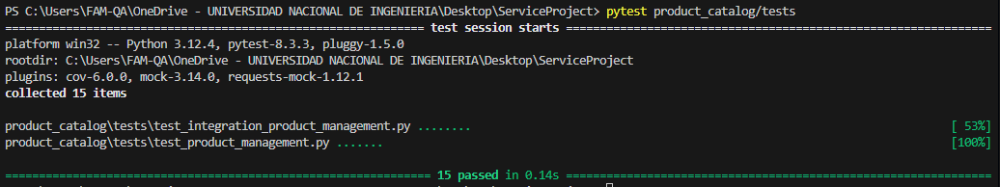

---

## Complejidad Ciclomática

Se utilizó `radon` para calcular la complejidad ciclomática de las funciones y métodos implementados. Este análisis asegura que el código sea mantenible y no excesivamente complejo.

- **Descripción**: Evalúa la complejidad de las funciones/métodos en ambos módulos, garantizando un nivel aceptable para su mantenibilidad.
- **Resultados**:
  - **Parte 1**: 
    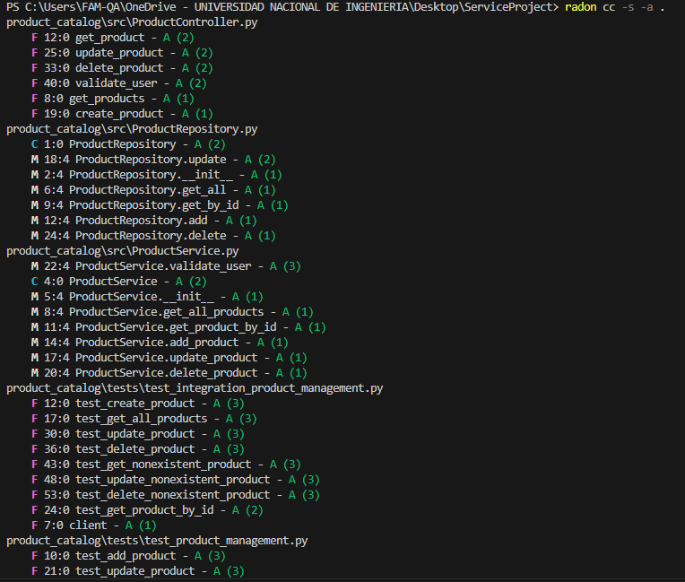
  - **Parte 2**: 
    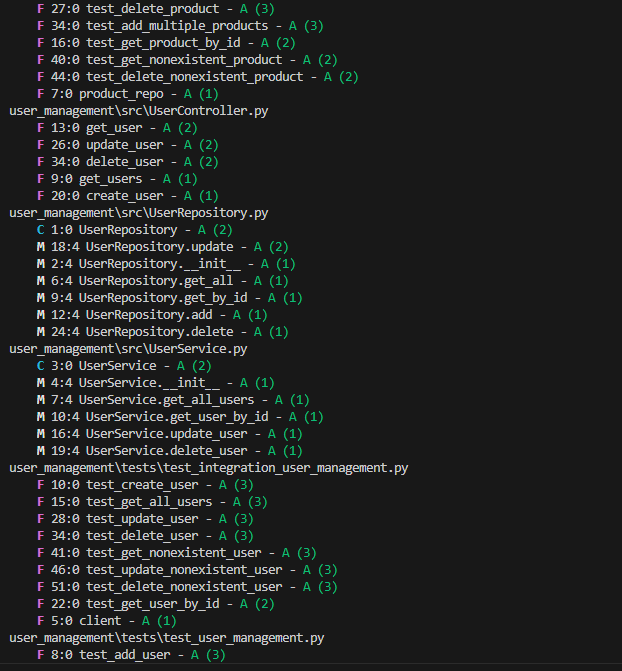
  - **Parte 3**: 
    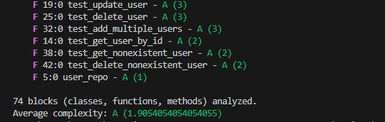

---

## Cobertura de Código

Utilizando `pytest-cov`, se midió la cobertura de código de las pruebas unitarias e integraciones realizadas. Se aseguraron altos porcentajes de cobertura para validar que las pruebas abarcan todas las funcionalidades críticas.

### Módulo `product_catalog`
- **Cobertura**: 86%
- **Imagen de resultados**:
  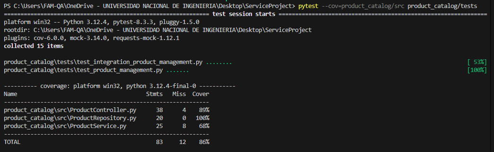

### Módulo `user_management`
- **Cobertura**: 99%
- **Imagen de resultados**:
  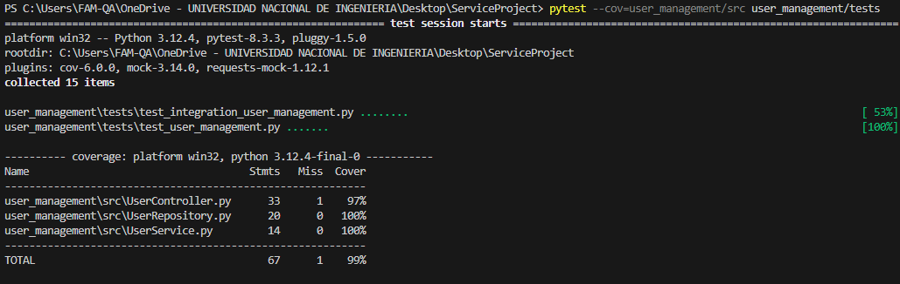

---

## Logging

El sistema de logging fue implementado con diferentes niveles de detalle (`DEBUG`, `INFO`, `WARNING`, `ERROR`). En la siguiente imagen se muestran ejemplos generados por el módulo `user_management`.

- **Descripción**: Mensajes generados al procesar una solicitud y manejar excepciones.
- **Imagen de resultados**:
  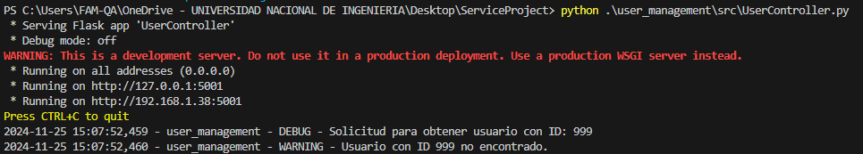

---

